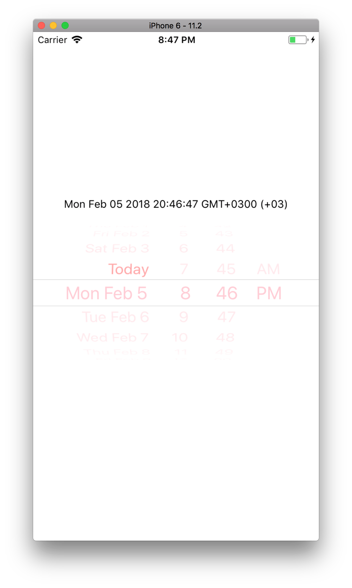

# react-native-custom-datepicker-ios

Customizable DatePickerIOS compoent.

This functionality was implemented by @nitrogenlabs [PR#10356](https://github.com/facebook/react-native/pull/10356), but wasn't accepted
because of private API usage and risk of App Store publication rejection.
So I decided to create separate package which implements this functionality
because we wont' see it merged to React Native.

You can integrate this package with [react-native-wheel-datepicker](https://github.com/pinguinjkeke/react-native-wheel-datepicker) to provide same API for both Android and iOS platforms.

See the 'CustomDatePickerIOS integration' section in [react-native-wheel-datepicker](https://github.com/pinguinjkeke/react-native-wheel-datepicker#readme) README.



Features implemented:
- textColor

## How to use

Run command

```
npm i react-native-custom-datepicker-ios
// or
yarn add react-native
```

Then link iOS dependencies
```
react-native link react-native-custom-datepicker-ios
```

## Example Code

You can see some usage code inside project's examples folder.

```jsx
import CustomDatePickerIOS from 'react-native-custom-datepicker-ios';

// ...
state = {
  currentDate: new Date(),
};

handleDateChange = currentDate => this.setState({ currentDate });

render() {
  return (
    <CustomDatePickerIOS
      date={this.state.currentDate}
      onDateChange={this.handleDateChange}
      style={{ width: '100%' }}
      textColor='pink'
    />
  );
}
```

## Contribution

If you want to add new features such as changing separators color, your PR is welcome!
